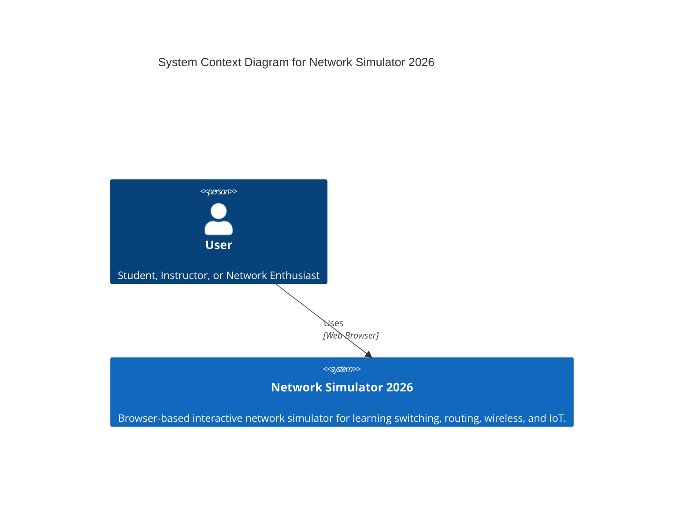
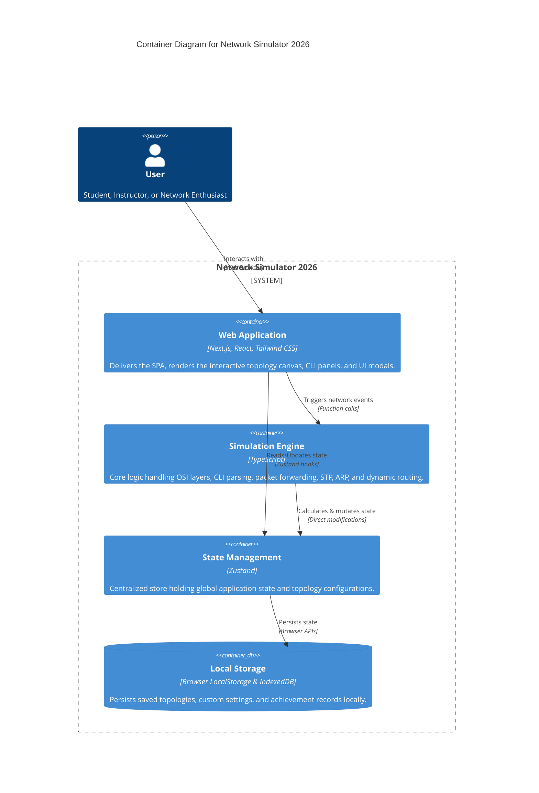

# Network Simulator 2026


A browser-based network simulator for learning switching, routing, wireless, IoT, CLI, and exam workflows.

**Live app:** [network2026.vercel.app](https://network2026.vercel.app)

---

## Quick Start

```bash
npm install && npm run dev
```

## Recent Updates / Son Güncellemeler

- **Industry-Specific Scenarios / Sektörel Senaryolar:** Hastane, E-Ticaret, Okul Kampüsü ve SOHO gibi gerçek dünya kullanım senaryoları eklendi.
- **Advanced IPv6 Master Lab / Gelişmiş IPv6 Laboratuvarı:** Dual-stack, OSPFv3 ve IPv6 ACL konularını içeren kapsamlı yeni eğitim modülü eklendi.
- **"Bana Öğret" Rehberli Dersleri / Teach Me Guided Lessons:** Sıfırdan öğretim için 3 yeni seviye (Temel, Orta, İleri) eklendi; ipconfig, enable, configure terminal, hostname, router IP yapılandırma, OSPF ve ACL adım adım öğretiliyor.
- **PC Tabanlı Arıza Giderme / PC-based Troubleshooting:** Arıza tanımları artık PC özelliklerini (IP, gateway, DNS) doğrulayabiliyor; otomatik komut yazdırma (`pc-auto-type`) desteği eklendi.
 
## Stats / İstatistikler

| Metric / Metrik | Value / Değer |
| --- | ---: |
| Total Lines / Toplam Satır (src/) | 108,410 |
| Source Files / Kaynak Dosya | 315 |
| Documentation Files / Dokümantasyon Dosya | 23 |
| Example Projects / Örnek Proje | 43 |
| Guided Lessons / Rehberli Ders | 19 |
| Exams / Sınavlar | 6 |
| CLI Commands / CLI Komutları | 386+ |

## Documentation / Dokümantasyon

| Document / Doküman | Description / Açıklama |
| --- | --- |
| [INSTALL.md](INSTALL.md) | Installation & build instructions / Kurulum & derleme talimatları |
| [USAGE.md](doc/USAGE.md) | Usage guide & keyboard shortcuts (TR/EN) / Kullanım kılavuzu & klavye kısayolları |
| [NETWORK_SIMULATOR_KITAPCIK.md](doc/NETWORK_SIMULATOR_KITAPCIK.md) | Comprehensive Turkish training booklet / Kapsamlı Türkçe eğitim kitapçığı |
| [history.md](doc/history.md) | Full changelog newest-to-oldest / Yeniden eskiye tam değişiklik geçmişi |
| [DOCUMENTATION_INDEX.md](doc/DOCUMENTATION_INDEX.md) | Documentation index & reading map / Diğer tüm belgeler için indeks |
| [ProjeOzellikleri.md](doc/ProjeOzellikleri.md) | Full features inventory (TR/EN) / Tüm özellikler envanteri (TR/EN) |
| [AGENTS.md](AGENTS.md) | Dev agent conventions, version bump & rollback / Agent kuralları, versiyon & rollback |

## Architecture / Mimari

### C4 Architecture Diagrams

**1. System Context Diagram**


**2. Container Diagram**


### Directory Structure

```
src/
├── app/                  # Next.js App Router — pages & layouts
│   ├── api/             # API routes (contact, etc.)
│   ├── [id]/            # Dynamic routes
│   ├── layout.tsx       # Root layout
│   ├── page.tsx         # Home page
│   └── globals.css      # Global styles & design tokens
├── components/           # React components
│   ├── ui/              # Reusable UI (cards, dialogs, panels, inputs)
│   └── network/         # Network-specific (Terminal, Topology, PCPanel)
├── contexts/            # React contexts (theme, mode, language)
├── hooks/               # Custom React hooks
├── lib/
│   ├── design-tokens/  # Design tokens (colors, typography, spacing, animations)
│   ├── store/          # Zustand state management (appStore.ts)
│   ├── network/         # Network simulation engine
│   │   ├── core/        # CLI command implementations
│   │   └── examples/    # Example project JSON files
│   ├── security/        # Security utilities (sanitization, rate limiting)
│   ├── performance/     # Performance optimization (spatial partitioning)
│   └── storage/         # Storage utilities (window position management)
├── utils/               # Utilities (achievement records tracking)
└── tests/               # Unit & integration tests (Vitest, 552 tests)
```

## Tech Stack / Teknoloji

Next.js 16.2, React 19, TypeScript 6.0, Tailwind CSS 4, Radix UI, Zustand 5.0

## License / Lisans

Free and open source. See [LICENSE](LICENSE).

Özgür ve açık kaynak. [LICENSE](LICENSE) dosyasına bakın.
