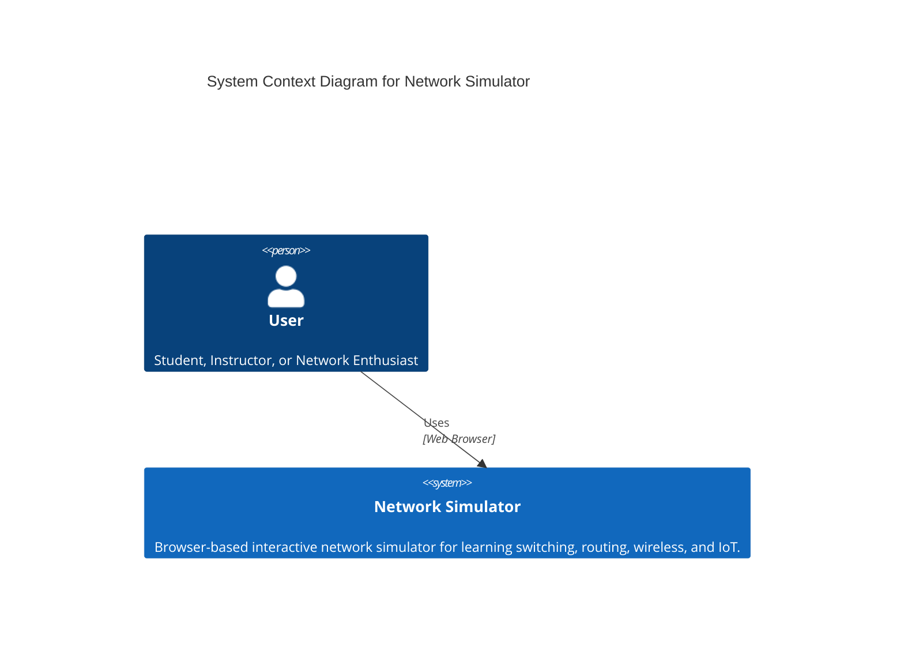
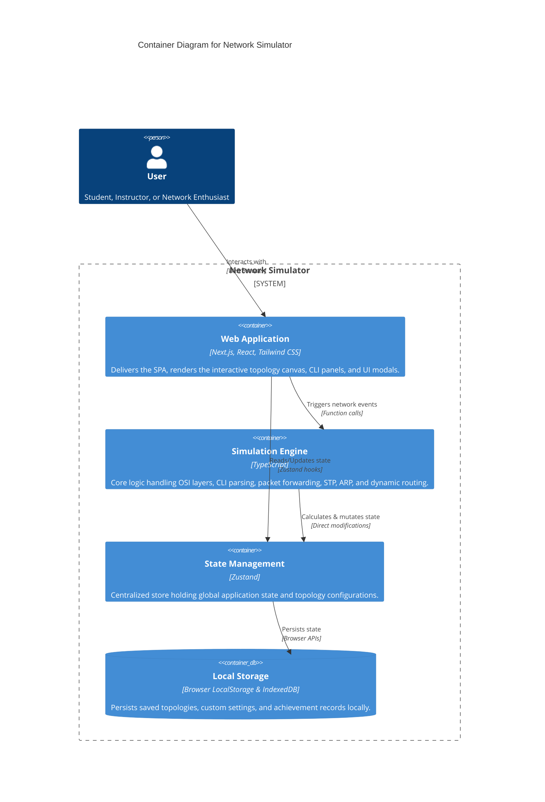

# NetworkSimulator — Tam Özellik Envanteri / Full Feature Inventory

**Sürüm / Version:** 4.9.0 · **Son doğrulama / Last verified:** 2026-09-10

## Son Ağ Simülasyonu Geliştirmeleri (2026-09-10 - v4.9.0)

| Özellik | Güncel kapsam ve sınır |
|---|---|
| **BGP & MP-BGP (Border Gateway Protocol)** | Autonomous System (AS) yönlendirmesi, eBGP/iBGP durum makineleri (`Established`, `Active`), AS-Path döngü engelleme, `address-family vpnv4` ile VRF/RD/RT taşıma ve `show ip bgp` / `show ip bgp summary` dökümü (`bgpEngine.ts`). |
| **MPLS & LDP (Label Distribution Protocol)** | Çekirdek ISP şebekeleri için LDP oturumları, LFIB (Label Forwarding Information Base) etiket takası (In-Label / Out-Label), Penultimate Hop Popping (PHP - `Implicit-Null`) ve `show mpls forwarding-table` desteği (`mplsLdpEngine.ts`). |
| **Görsel DHCP Sunucu & Havuz Yönetimi** | Router ve Sunucularda tanımlı DHCP havuzlarının kapasite/doluluk oranları (% bar), kiralanan IP, MAC, Hostname ve sürelerini filtreleyip yöneten interaktif modal (`DhcpPoolManagerModal.tsx`). |
| **"Neden Ping Gitmiyor?" Kök Neden Teşhisi** | L1 fiziksel link/shutdown, L2 VLAN/Trunk/Native VLAN uyumsuzlukları, L3 Subnet & Default Gateway eksikliklerini otomatik tarayıp çözüm önerileri sunan Stethoscope teşhis motoru ve modalı (`networkTroubleshooter.ts`, `NetworkDiagnosticsModal.tsx`). |
| **Akıllı CLI İpucu & Sözdizimi Tamamlama Motoru** | `ip address`, `ip route`, `switchport mode`, `router ospf` komutlarında eksik parametre girildiğinde doğru formatı ve parametre şablonunu terminalde anında gösteren akıllı yönlendirme (`smartCliHints.ts`). |
| **Otomatik Topoloji Düzenleme (Auto Layout)** | Karışık ağları tek tuşla 3-Tier Hiyerarşik (Core-Distribution-Access), Yıldız (Star), Halka (Ring) veya Matris (Grid) düzenlerine dizen yerleşim algoritması (`autoLayoutEngine.ts`). |
| **Kablo & Port Etiketleri Aç/Kapa** | Kablolar üzerindeki arayüz isimlerini (Gi0/0, Fa0/1) tuvalde doğrudan açıp kapatabilme seçeneği (`ViewVisibilityMenu.tsx`). |
| **WLC Wi-Fi SSID & Güvenlik Yansıması** | WLC'de tanımlı ve aktif (`status: enabled`) WLAN'ların SSID, parola ve güvenlik modu bilgisi, `getDeviceWifiConfig` üzerinden kablosuz ağ yapılandırmasına (AP modu) otomatik yansıtılıyor (`wireless.ts`). |
| **WLC Varsayılan Yönetim IP Düzeltmesi** | WLC GigabitEthernet0/1 varsayılan IP adresi ağ geçidiyle uyumlu olması için `192.168.1.254` yerine `192.168.1.1` yapıldı (`initialState.ts`). |
| **PC/IoT/Yazıcı/WLC Cihazlarında HTTP Varsayılan Açık** | Araç çubuğundan eklenen PC, IoT, Yazıcı ve WLC cihazlarında HTTP servisi varsayılan `enabled: true` ile oluşturuluyor; PC'ler için `Welcome to <cihaz adı> Web Server` içerik şablonu, WLC'ler için `WLC-DHCP-POOL` (gw `192.168.1.1`, DNS `8.8.8.8`) tanımlanıyor (`useCanvasActions.ts`). |
| **İlk PC'de HTTP Varsayılan Açık** | Boş proje, senaryo üretici ve örnek projelerde tüm PC'lere `services.http.enabled: true` uygulanıyor; PC'ler ilk eklendiğinde HTTP "açık" başlıyor (`useProjectReset.ts`, `scenarioGenerators.ts`, `exampleProjects/helpers.ts`). |
| **PC HTTP Aç/Kapa Toggle Stabilizasyonu** | HTTP düğmesine basıldığında durumun anında geri dönmesi giderildi; `update-topology-device-config` `services.http`'i runtime `SwitchState`'e de yansıtıyor ve `ip http server` satırıyla senkron tutuyor; `getOrCreateDeviceState` canvas `services` bilgisiyle başlıyor (`usePageNetworkLogic.ts`, `useDeviceManager.ts`). |
| **Cihaz Bilgi Popover Servis Rozetleri** | PC bilgi popover'larındaki HTTP/DNS/DHCP/FTP/MAIL/NTP/SYSLOG rozetleri canvas `services` + runtime cihaz durumunu birlikte değerlendiriyor (`DeviceInfoPopovers.tsx`). |
| **Terminal UX Modülarizasyonu (8 Claude Önerisi)** | `Terminal.tsx` bölümlendi; `BootProgressBar.tsx`, `TerminalHeaderActions.tsx`, `useTerminalTabCompletion.ts`, `PythonInputModal.tsx`, `PCPanelDialogs.tsx` + `PCPanelContext.tsx` eklendi. |
| **Firewall Tip Güvenliği & `same-security-traffic`** | ASA `same-security-traffic` komutu tip güvenli `SwitchState.sameSecurityTraffic` alanını kullanıyor; `as unknown as Partial<SwitchState>` cast'leri temizlendi (`firewallCommands.ts`, `types.ts`). |
| **Deterministik Ping Gecikmesi (PRNG)** | Kablosuz uzaklığa göre ping gecikmesi ve hop sürelerinde tekrarlanabilir çıktı için tohumlanabilir deterministik PRNG kullanıldı (`privilegedConnectivity.ts`). |
| **Bulut Bağlantısız Durum Denetimi** | Cloud/WAN cihazı topolojide yok veya kablosuz bağlı değilken kamu DNS adreslerine gidiş "Bulut (Cloud) cihazı ağa bağlı değil." hatası ve "Bulut Bağlantısız" ekranı ile açıklanıyor (`usePCPanelBrowser.ts`, `pathResolution.ts`). |
| **Silinen Cihaz Geçmişi Temizleme** | Geçmiş kopyalamada artık bulunmayan cihazların `deviceOutputs`/`pcOutputs`/`pcHistories` verileri temizleniyor (`historySerialization.ts`). |
| **HTML Entity Çözme (`decodeHTMLEntities`)** | Sanitize edilmiş metinlerdeki HTML entity'lerin orijinal karakterlere güvenli dönüşümü sağlandı (`sanitizer.ts`). |
| **Connectivity `resolvePathTraffic` Ayıklaması** | QoS/IPsec trafik çözümleme fonksiyonu bağımsız `resolvePathTraffic.ts` modülüne taşındı; döngüsel bağımlılık azaltıldı. |

## Son Ağ Simülasyonu Geliştirmeleri (2026-09-06 - v4.6.0)

| Özellik | Güncel kapsam ve sınır |
|---|---|
| **Canlı Paket İzleme UI Inspector** | Paketin tuval ve düğümler üzerindeki hop, aşama (`L1`, `Port Security`, `STP`, `VLAN`, `ACL`, `Routing/MAC Lookup`, `QoS`, `Capture`), eylem (`pass`, `drop`, `forward`, `flood`, `trap`) kararlarını, gerekçe açıklamalarını ve frame snapshot'larını canlı gösteren interaktif paket analiz paneli (`PacketTraceInspector.tsx`). |
| **RFC Standartlarında ICMP Hata Kodları & Paket Üretimi** | RFC 792 ve RFC 4443 standartlarına uygun ICMP Type 3 (Destination Unreachable: Code 0 Net Unreachable, Code 1 Host Unreachable, Code 3 Port Unreachable, Code 13 Admin Prohibited) ve Type 11 (Time Exceeded: Code 0 TTL Exceeded) hata paket üretimi (`icmpUtils.ts`). |
| **Standartlaştırılmış Katman-3 TTL Decrementing** | Tüm Router, L3 Switch ve Firewall yönlendirme yollarında TTL'nin 1 eksiltilmesi ve TTL 0'a ulaştığında paketin düşürülüp göndericiye ICMP Time Exceeded yanıtı dönülmesi (`packetPipeline.ts`). |
| **Gerçek Zamanlı ARP ve MAC Aging Motoru** | MAC adresi dinamik kayıtları (300sn) ve ARP önbelleği (120sn) için canlı arka plan yaşlanma ve temizleme mekanizması (`agingEngine.ts`). |
| **ACL Paket Sayacı & İzleme Yöntemi** | Erişim kontrol listelerindeki (ACL) her kural için canlı paket ve bayt eşleşme sayaçlarının tutulması, `show access-lists` çıktısına yansıtılması ve ACL engelinde ICMP Code 13 üretimi (`acl.ts`). |
| **VLAN & Trunk Uyumsuzluk Teşhisleri** | Bağlı trunk ve access switch portlarındaki Native VLAN uyuşmazlığı, Allowed VLAN farkları ve Access VLAN uyumsuzluklarını otomatik tespit eden teşhis tarayıcısı (`vlanDiagnostics.ts`). |
| **Detaylı Routing Karar Açıklamaları** | Rota seçiminde Longest-Prefix Match (LPM) (örn. `10.0.0.0/24`), Administrative Distance (AD) (Connected: 0, Static: 1, EIGRP: 90, OSPF: 110, RIP: 120) ve Metric değerlerini analiz edip gerekçelendiren `findRouteDetailed` motoru (`routing.ts`). |
| **MAC Yaşam Döngüsü Olay Günlüğü** | MAC adresi öğrenme (`LEARN`), portlar arası geçiş/flapping (`MOVE`), zaman aşımıyla silinme (`AGE`) ve unicast miss durumunda taşma (`FLOOD`) olaylarını yayınlayan log altyapısı (`macLearning.ts`). |
| **Canlı Arayüz Trafik İstatistikleri** | Arayüzlerden paket geçtikçe ve düştükçe `rxPackets`, `rxBytes`, `txPackets`, `txBytes`, `rxDrops`, `txDrops` istatistiklerinin gerçek zamanlı hesaplanması ve `show interfaces` komutuna yansıtılması (`packetPipeline.ts`). |
| **Paket Düşürme Nedeni Standartlaştırması** | Tüm Katman-1, Katman-2, Katman-3, ACL, STP ve Güvenlik paket düşürme gerekçelerinin standart `DropReasonCode` enum'ları ve düzeltme önerileri ile sınıflandırılması (`dropReasons.ts`). |

## Son Ağ Simülasyonu Geliştirmeleri (2026-09-06 - v4.5.0)

| Özellik | Güncel kapsam ve sınır |
|---|---|
| **Çift Yönlü Otomatik VoIP Arama Kapanma Guard** | Telefon araması esnasında kablo sökülmesi, kablosuz bağlantı kopması, IP değişikliği veya karşı cihazın kapanması durumunda her iki tarafın aktif aramasını eş zamanlı sonlandıran ve ekran pencerelerine *"Arama Sonlandırıldı: Bağlantı koptu!"* bildirimi yansıtan otomatik ağ denetim mekanizması uygulandı. |
| **Bulut Cihazı SVG Port Düzeni ve Numaralandırması (1-4)** | Bulut (`cloud`) cihazının altındaki portların konumlandırması sağa hizalandı ve port isimleri (`W`, `L`) standartlaşarak `1`, `2`, `3`, `4` rakamlarına çevrildi. |
| **Birleştirilmiş Fare & Klavye Kısayolları Paneli** | F1 Yardım ve Komut Referansı modalında Klavye Kısayolları kategorisi, tüm klavye tuş kombinasyonları ve fare etkileşimlerini (Sol Tık, Çift Tık, Sağ Tık, Scroll Zoom, Pan, Otomatik Kopyalama) kapsayacak şekilde **"Fare & Klavye Kısayolları"** tek birleştirilmiş başlık altında yeniden düzenlendi. |

## Son Ağ Simülasyonu Geliştirmeleri (2026-09-05 - v4.4.0)

| Özellik | Güncel kapsam ve sınır |
|---|---|
| **WAN Bulut ICMP / Ping Desteği** | `1.1.1.1` ve `8.8.8.8` genel kamu DNS/WAN IP adreslerine web tarayıcısının yanında PC komut satırı ve cihaz pencerelerinden `ping` atılabilmesi için Katman-3 Varsayılan Ağ Geçidi (Default Gateway) ve ICMP paket iletim rotaları entegre edildi. |
| **Sadece Geçerli WAN/Kamu IP Doğrulaması** | Topolojide olmayan yerel veya geçersiz IP adreslerine (`192.168.1.1111` vb.) ping atıldığında yanlışlıkla Bulut cihazına düşüp "ping başarılı" denmesi engellendi; yalnızca doğrulanan kamu DNS IP'leri (`1.1.1.1`, `8.8.8.8`) ve açıkça tanımlı Cloud IP'leri için bulut yönlendirmesi kısıtlanarak hatalı IP'lerde "Request timed out" üretilmesi sağlandı. |
| **Fare İle Metin Seçince Otomatik Panoya Kopyalama (Auto-Copy)** | PC Komut İstemi (CMD), Linux Terminali, Cihaz Konsol Sekmesi (`CommandLineTab.tsx`, `ConsoleTerminalTab.tsx`) ve Ana CLI Terminal penceresinde (`Terminal.tsx`) komut/çıktı geçmişi alanlarında fare ile sürükleyip metin seçimi tamamlandığında (`onMouseUp`), seçilen metnin otomatik olarak panoya (clipboard) kopyalanması eklendi. |
| **CMD & CLI Komut Önerileri (Autocomplete) Hizalaması** | Komut tamamlama açılır penceresinde IP önerileri ile komut önerilerinin yan yana bitişik kelimeler halinde kayması engellendi. Öneri listesi `flex flex-col` yapısında dikey butonlar halinde hizalandı. |

## Son Ağ Simülasyonu Geliştirmeleri (2026-09-04 - v4.3.0)

| Özellik | Güncel kapsam ve sınır |
|---|---|
| **Akıllı Cihaz Hizalama Araç Çubuğu & Undo/Redo** | Topolojide çoklu cihaz seçildiğinde beliren Sola, Sağa, Üste, Yatayda Ortala ve Dikeyde Ortala araç çubuğu ikonları yenilendi; hizalama eylemlerine `saveToHistory()` kancası eklenerek `Ctrl+Z` ve `Ctrl+Y` ile geri alma ve yenileme tam aktif edildi. |
| **Bulut / WAN Arayüz & Port Listesi** | Bulut (`cloud`) cihazının detay görünümüne ISP Arayüz & Port Listesi eklendi; `Eth0..Eth3` portlarının UP/DOWN bağlantı durumları, IP adresleri ve komşu cihaz çözümlemesi sağlandı. |
| **Ağ Yazıcısı & Print Server Yönetimi** | Dual-interface Ethernet/Wi-Fi destekli Ağ Yazıcısı (`printer`) için DHCP IP otomatik kiralama, Wi-Fi SSID seçim arayüzü ve tuval sinyal çubukları eklendi. Dahili Embedded Web Server üzerinden LPD/515, IPP/631, JetDirect/9100, AirPrint, SNMP ve TLS 1.3 protokol anahtarları, güvenlik erişim yetkileri ve canlı Yazdırma Kuyruğu (`printJobs`) yönetimi sağlandı. PC ve Mobil Web Tarayıcılarından "Belgeyi Yazdır" butonu ile ağdaki aktif yazıcıya yazdırma isteği gönderme ve Paket Yakalama ekranında LPD/IPP paket akışlarını canlı izleme desteği eklendi. |
| **Mobil Web Tarayıcı** | Akıllı Telefon (`mobile`) cihazına adres çubuğu, yer imi kısayolları (`192.168.1.1`, `8.8.8.8`, `http://iot-panel`) ve `checkConnectivity` TCP port 80 denetimi ile Router/WLC Web Yönetimi, Yazıcı Paneli, IoT Kontrol Paneli, Genel WAN Arama ve PC HTTP Sunucusu web sayfalarını işleyen Web Tarayıcısı eklendi. |
| **Aktif Bulut / WAN Geçit Cihazı (`cloud`)** | Topolojideki Bulut (`cloud`) cihazı `203.0.113.1` genel WAN IP adresi, `eth0..eth3` portları ve transit köprü yönlendirmesi ile tam fonksiyonel yapıldı. Genel DNS/NTP IP'lerine (`8.8.8.8`, `1.1.1.1`, `pool.ntp.org`) veya dış alan adlarına yapılan ping ve web istekleri topoloji üzerindeki Bulut cihazına yönlendirildi. |
| **Ağ Özeti & Syslog Sunucusu Desteği** | Ağ Özetinde (Live Device List) PC ve uç cihazlar için Syslog Sunucusu aktiflik durumu ve kayıt sayısı eklendi. Hub cihazı Katman-1 katı tekrarlayıcı mantığı ile gereksiz CLI ve durum özeti alanlarından muaf tutuldu. |
| **Depolama Kotası & Güvenlik Optimize Edici (`secureStorage`)** | `localStorage` 5 MB kotasını aşmamak için geçmiş kaydı 15 işlem ile sınırlandırıldı ve acil durum temizliği entegre edilerek `QuotaExceededError` uyarısı giderildi. |

## Son Ağ Simülasyonu Geliştirmeleri (2026-09-03 - v4.1.0)

| Özellik | Güncel kapsam ve sınır |
|---|---|
| **Yeni Cihaz Desteği (Hub, Cloud, Mobile, Printer)** | Topolojiye 4 yeni cihaz tipi eklendi: Layer-1 Multiport **Hub** (`hub`), Dış İnternet **Cloud/WAN** (`cloud`), Kablosuz **Akıllı Telefon/Tablet** (`mobile`) ve Ağ **Yazıcısı** (`printer`). Tuval üzerinde gerçekçi SVG gövde/ikon çizimleri ve 2-satırlı ultra-kompakt araç çubuğu entegre edildi. |
| **MSTP Bölge Sınırı İzolasyonu (IEEE 802.1s)** | MST bölge adı, revizyonu ve digest kontrolü (`areSameMstRegion`) eklendi. CIST BPDUs bölge dışına taşınırken MSTI BPDUs bölge sınırında izole edildi. |
| **802.1X EAPOL Port Güvenliği** | EAPOL-Start, Identity Request/Response, EAPOL-Success/Failure paket seviyesinde port kontrolü ve RADIUS doğrulaması uygulandı. |
| **QoS Token Bucket Police & Shape** | Traffic Policing (`police <rate>`) ve Traffic Shaping (`shape average <rate>`) bant genişliği limitleme motoru entegre edildi. |
| **IPsec Site-to-Site GRE over IPsec** | `crypto isakmp policy/key`, `crypto ipsec transform-set`, `crypto map` komutları, ESP tünel şifreleme ve `show crypto sa` komutları tamamlandı. |
| **BGP Politika & Ağırlık Atamaları** | `neighbor route-map` ve `neighbor weight` komutları ile BGP best-path karar mekanizması derinleştirildi. |
| **DHCP Snooping Option 82 & Rate-Limit** | `ip dhcp snooping information option` ve interface `ip dhcp snooping limit rate` CLI komut desteği eklendi. |
| **Wireless Roaming & RF Parametreleri** | AP kapsama alanı, sinyal seviyesi (RSSI), kanal çakışması denetimi ve AP'ler arası kesintisiz müşteri roaming geçişi desteklendi. |
| **EIGRP for IPv6** | `ipv6 router eigrp <as>`, router-id tanımı, arayüz bazlı `ipv6 eigrp <as>` aktifleştirme, DUAL IPv6 metric hesaplaması ve `show ipv6 eigrp neighbors/topology` komutları eklendi. |
| **IP & IPv6 Prefix-List** | `ip/ipv6 prefix-list <name> [seq <n>] {permit\|deny} <prefix> [ge <ge>] [le <le>]` kural motoru, ön ek eşleme doğrulama ve `show ip/ipv6 prefix-list` raporlaması entegre edildi. |
| **Route-Map Politika Motoru** | `route-map <name> {permit\|deny} [<seq>]` mod yapılandırması, `match ip/ipv6 address prefix-list`, `match interface`, `set metric`, `set ip/ipv6 next-hop`, `set local-preference` alt komutları ve `show route-map` çıktısı eklendi. |
| **GLBP (Gateway Load Balancing Protocol)** | `glbp <group> ip <ip>`, `glbp priority/preempt/weighting` komutları, AVG (Active Virtual Gateway) seçimi, `0007.b400.XXXX` sanal MAC adresi üretimi ve `show glbp [brief]` raporlaması desteklendi. |
| **STP Loop Guard** | `spanning-tree loopguard default` (global) ve `spanning-tree guard loop` (interface) yapılandırmaları ile BPDU kaybında portun `loop-inconsistent` engel moduna geçirilmesi sağlandı. |
| **NetFlow İletim Motoru** | `ip flow-export destination <ip> <port>`, `ip flow-export version <5\|9>`, interface `ip flow ingress/egress` ve canlı `show ip cache flow` istatistik izleme ekranı eklendi. |


## Son Ağ Simülasyonu Geliştirmeleri (2026-09-01 - v3.8.0)

| Özellik | Güncel kapsam ve sınır |
|---|---|
| **Not İçi Klavye & Giriş Koruması** | Topoloji tuvalindeki notlarda (`NoteNode`) ve metin kutularında yazı yazılırken `TAB`, `0`, `+`, `-`, `Home` gibi tuşların global kısayolları tetiklemesi engellendi; `TAB` tuşu yalnızca not içi 4-boşlukluk sekme/girinti ilerletmesi yapar. |

## Son Ağ Simülasyonu Geliştirmeleri (2026-08-31 - v3.7.0)

| Özellik | Güncel kapsam ve sınır |
|---|---|
| **Rehberli Ders Konu Quiz'leri & Skor Entegrasyonu** | 19 rehberli ders konusuna özel (IP, VLAN, Statik Yönlendirme, DHCP, DNS, SOHO vb.) 2-3 soruluk soru havuzu eklendi. Quiz sorularının puanları (+10 puan) canlı Rehberli Ders ilerleme skoruna ve localStorage kaydına bağlandı. |
| **High-DPI Türkçe PDF Sertifika Motoru** | jsPDF içerisine entegre Canvas 2400x1700 High-DPI Türkçe karakter (Ş, İ, Ğ, Ç, Ö, Ü) çizim motoru geliştirildi. Sertifikalar tüm işletim sistemlerinde sıfır font hatası ve keskin görünüm ile indirilebilir. |
| **Rehberli Ders Birincil Sekme Mimarisi** | Açılış projesi seçim modalında ve varsayılan panel ayarlarında "Rehberli Dersler" ilk sekme yapıldı. |
| **Statik Yönlendirme 24 Adımlı Laboratuvar** | R1 ve R2 için Gi0/0 ve Gi0/1 (PC Gateway) IP atamaları, interface `no shutdown`, `exit`, statik rotalar ve `ping 192.168.2.10` uçtan uca test adımları detaylandırıldı. |
| **SOHO Ofis Ağ Kurulumu & DHCP / WiFi Revizyonu** | DHCP havuz yapılandırma adımları (`ip dhcp pool OFIS`, `network`, `default-router`) ve Laptop (PC-2) kablosuz bağlantısı CLI & PC WiFi uygulaması ile uçtan uca senkronize edildi. `defaultRouter` / `defaultGateway` esnek doğrulama desteği sağlandı. |

## Son Ağ Simülasyonu Geliştirmeleri (2026-08-30)

| Özellik | Güncel kapsam ve sınır |
|---|---|
| **LLDP Neighbors Detail** | `show lldp neighbors detail` çıktısında sabit (hardcoded) Chassis ID ve Management IP yerine bağlı olan komşu cihazın dinamik MAC adresi ve IP bilgileri çekilir. |
| **FHRP Virtual MAC & IP** | HSRP v1 (`0000.0c07.acXX`), HSRP v2 (`0000.0c9f.fXXX`) ve VRRP (`0000.5e00.01XX`) standart sanal MAC adresi hesaplama motoru eklendi; sanal IP adresleri `pathResolution.ts` üzerinde dinamik olarak aktif gateway cihazına çözümlenmektedir. |
| **DHCP Relay (`ip helper-address`)** | Arayüz bazlı `ip helper-address` komutları ile cross-subnet DHCP broadcast paketleri unicast helper adresine yönlendirilir. Parametreli `no ip helper-address <ip>` silme komutları desteklenmektedir. |
| **DHCP Snooping & Rogue Protection** | Untrusted portlardan gelen sahte DHCP OFFER/ACK paketleri engellenir. İstemci IP kiraladıkça switch üzerinde canlı `DHCP Snooping Binding Table` oluşturulur ve `show ip dhcp snooping binding` ile raporlanır. |

## Son Ağ Simülasyonu Geliştirmeleri (2026-08-29)

Bu bölüm, özelliklerin gerçekten hangi katmanda çalıştığını ayırır: **entegre** özellikler kullanıcı akışına bağlıdır; **simülasyon motoru** özellikleri deterministik çekirdek fonksiyonları sağlar; **kavramsal/helper** özellikler henüz gerçek paket/daemon akışına bağlı değildir.

| Özellik | Güncel kapsam ve sınır |
|---|---|
| **IP SLA Active Probes** | `icmp-echo`/`jitter` operasyonu, RTT min/avg/max, jitter, başarı/timeout sayaçları, `ip sla schedule`, arka plan periyodik tetikleme ve `show ip sla statistics` entegredir. Prob hedef erişilebilirliği simüle edilir; gerçek ağ soketi kullanılmaz. |
| **QoS Queue Scheduling** | Deterministik WFQ, LLQ ve CBWFQ motoru; kapasite doygunluğunda düşürme ve sınıf sayaçları vardır. `class-map`/`policy-map` temel tanım durumunu, interface `service-policy` bağlantısını ve `pathResolution` trafik kancasını destekler; gelişmiş MQC `match/set/police/shape` alt eylemleri henüz yoktur. |
| **LLDP / LLDP-MED** | LLDP global/interface ayarları, `lldp tlv-select`, periyodik LLDP paketleri ve gerçek bağlı cihazdan dinamik chassis ID/management IP ile `show lldp neighbors detail` çıktısı vardır. |
| **FHRP ve DHCP entegrasyonları** | HSRP/VRRP seçimi sanal gateway çözümlemesine bağlıdır; `ip helper-address` DHCP broadcast relay yapar; DHCP snooping untrusted portlardan gelen DHCP Offer/ACK trafiğini filtreler. |
| **MSTP BPDU Engine** | CIST root election, MSTI M-record, region digest ve boundary kontrolü `mstp.ts` helper motorunda vardır; henüz ana `stp.ts` topoloji BPDU akışına tam bağlanmamıştır. |
| **802.1X EAP** | `dot1x system-auth-control`, interface port-control, EAPOL state machine ve RADIUS erişilebilirliği simüle edilir; gerçek EAPOL/RADIUS taşıması ve tam authenticator daemon’ı yoktur. |
| **IPsec** | IKE Phase 1/2 SA ve ESP protocol 50 veri modeli ile `resolvePathTraffic` içindeki simülasyon kancası vardır; gerçek şifreleme, anahtar görüşmesi ve `cryptoCommands.ts` CLI kayıt akışı henüz yoktur. |
| **SDN / YANG / DNA Center** | Minimal YANG module/leaf parser, typed datastore, NETCONF/RESTCONF tarzı in-memory API ve kavramsal SDN/DNA Center quiz’i vardır; HTTP controller daemon’ı yoktur. |
| **Yardım ve terim sözlüğü** | CLI context help; IP SLA, QoS, LLDP, 802.1X komutları; Türkçe/İngilizce ağ terimleri ve kısaltmaları yardım penceresinde günceldir. |

IP SLA, QoS, parser/CLI, LLDP, MSTP, 802.1X, SDN ve ağ entegrasyonları için otomatik testler bulunmaktadır.

## Türkçe (Turkish)

### 🖥️ Cihazlar ve Topoloji
- Router, L2/L3 Switch, PC, Firewall, Access Point, IoT cihazı, Wireless LAN Controller (WLC).
- Sürükle-bırak topoloji editörü, kablo çizme (masaüstü sürükleme + mobil tap-tap).
- Bağlantı uyumluluk kontrolü (geçersiz kablo bağlantısında uyarı).
- Port seçici modal, bağlantı hattı görselleştirme.
- Topoloji görselini PNG olarak dışa aktarma.
- Ortam arka planları (environment backgrounds).
- Spatial partitioning (100+ cihazda yüksek performans optimizasyonu).

### ⌨️ CLI / Terminal
- Gerçekçi CLI komut satırı (user, privileged, global-config, interface, line, vlan, router-config ve adlandırılmış-ACL modları).
- PC CMD ve Dosya Düzenleyici ortamında simüle edilmiş **Python 3 yorumlayıcısı** (öğretim amaçlı kapsam):
  - **OOP:** Sınıflar (`class`), kurucu metot (`__init__`), nitelik bağlama (`self`), kalıtım (inheritance), `super()`, `isinstance()`.
  - **Decorator'lar:** `@property`, `@<name>.setter`, `@staticmethod`, `@classmethod` ve kullanıcı tanımlı decorator fonksiyonları.
  - **Generator'lar:** `yield` ve `yield from` ile tembel iterasyon (lazy evaluation).
  - **Modül Desteği:** `json`, `re` (regex), `os.path`, simüle edilmiş `socket` (ağ programlama betikleri için), `math`, `random`, `datetime`, `sys`.
  - **Güvenlik Katmanı:** Tarayıcı sandbox koruması ve dunder nitelik bloklaması.
- PC CMD'de kullanıcı tanımlı `.bat` ve `.cmd` yığın dosyaları çalıştırma (`@echo off`, `set`, `%VAR%`, `%1`, `goto`, `call`).
  - Dosya Düzenleyici (File Editor) pencerelerinde `Batch Yığın Dosyası` ve `Python Betiği` rozet etiketleri ile tek tıkla kaydedip CMD'de çalıştırma (Play).
  - **Linux Terminali (simüle Bash kabuğu):** PC terminalinde dosya, ağ ve temel sistem komutları (`ls`, `pwd`, `cd`, `cat`, `touch`, `mkdir`, `rm`, `cp`, `mv`, `chmod`, `chown`, `ifconfig`, `ip addr`, `dhclient eth0`, `dhclient -r eth0`, `ping`, `traceroute`, `nslookup`, `netstat`, `arp`, `ftp`, `ssh`, `telnet`, `curl`, `wget`, `whoami`, `hostname`, `uname -a`, `date`, `uptime`, `history`, `echo`, `sudo`). `for`/`while`, `if`, `$VAR`, `|`, `>`/`>>`, `grep`, `wc` ve `python3` desteklenir; bu gerçek işletim sistemi shell’i değil, sanal dosya sistemi üzerinde çalışan bir simülasyondur.
  - Tab tuşu ile otomatik komut ve dosya tamamlama.
- Komut geçmişi (Yukarı/Aşağı ok tuşları, kalıcı state).
- Pipe filtreleme (`show run | include`, `ping | find` vb.).
- Aktif moda göre değişen, mobil odaklı hızlı komut butonları.
- Renk kodlu gerçekçilik seviyesi göstergesi (`real` / `stub` / `sim-only`).
- Eğitici ve ipuçları içeren hata mesajları.

### 🌐 Protokoller
- VLAN, Trunk, STP (gerçek BPDU yayılımı).
- OSPF (multi-area destekli, gerçek Dijkstra SPF algoritması).
- EIGRP (DUAL motoru ve Feasibility Condition kontrolü).
- RIP ve RIPng yönlendirme protokolleri.
- HSRP ve VRRP yedeklilik protokolleri.
- BGP (Dinamik komşuluk durumu: Established / Idle eşleşmesi, remote-as, show ip bgp summary, show ip bgp).
- ACL (standard + extended, gerçek zamanlı eşleşme sayaçları).
- NAT/PAT (static, dynamic ve overload/PAT desteği, port kolonlu show ip nat translations çıktısı).
- SLAAC (no ipv6 nd suppress-ra ile bağlı PC'lerde EUI-64 otomatik IPv6 adres üretimi).
- DHCP sunucu ve istemci simülasyonu.
- Port Security (MAC kısıtlama, sticky MAC, ihlal eylemleri).
- DHCP Snooping (trusted/untrusted port, VLAN kapsamı ve DHCP Offer/ACK filtreleme; rate-limit/Option 82 yalnızca durum modelinde görüntülenir, ayrı CLI yapılandırması yoktur).
- Dynamic ARP Inspection (ip arp inspection).
- IP Source Guard (ip verify source, ip source binding).
- AAA (aaa new-model, RADIUS ve TACACS+ sunucu konfigürasyonu).
- SPAN Port Monitoring (monitor session, kaynak/hedef, rx/tx/both).
- EtherChannel: LACP (active/passive), PAgP (desirable/auto), static (on).
- Kablosuz Ağ (SSID, WPA şifreleme, AP ve WLC yönetimi).
- ARP, MAC öğrenme, TTL/Hop simülasyonu.
- PPP/HDLC WAN enkapsülasyonu, PAP/CHAP kimlik doğrulaması.
  - **IP SLA:** Sentetik aktif prob, schedule ve `show ip sla statistics` ile ölçüm.
  - **QoS:** WFQ/LLQ/CBWFQ kuyruk simülasyonu, doygunlukta drop ve MQC service-policy kancası.
  - **LLDP-MED / 802.1X:** TLV seçimi, komşu ayrıntıları, EAPOL/RADIUS state simülasyonu.
  - **MSTP / IPsec / SDN:** Ayrı helper/API katmanlarında CIST-MSTI, ESP/SA, YANG ve controller datastore simülasyonları.
  - **SSH (v1/v2) ve Telnet oturum yönetimi (uçtan uca çalışır):** `crypto key generate rsa modulus 2048` → `ip ssh version 2` → `username <kullanıcı> privilege 15 secret <parola>` → `line vty 0 4` → `login local` → `transport input ssh` zinciri ile tam yapılandırma. PC terminalinden `ssh <kullanıcı>@<ip>` komutu başarılı bağlantıyı simüle eder: RSA/anahtar+SSH v2+login local+transport ssh kontrolleri yapılır, parola yerel kullanıcı veritabanına karşı doğrulanır ve oturum `sshSessions` içine `established` olarak yazılır (`show ssh` / `show ip ssh` ile görülebilir).
  - `switchport trunk allowed vlan add/remove/except/all` sözdizimi ile VLAN filtreleme.

### 🎓 Müfredat Konuları Envanteri
- **Ağ Temelleri (Network Fundamentals):** IPv4/IPv6 Adresleme, Subnetting, VLSM, Link-Local IPv6 (`fe80::`), EUI-64 Host Adresi türetme, SLAAC (`no ipv6 nd suppress-ra`), Düz/Çapraz/Fiber/Seri kablolama.
- **Ağ Erişimi (Network Access / Switching):** VLANs (1-4094, 802.1Q, Native VLAN, Voice VLAN, Allowed VLAN listeleri), VTP v1/v2 (Server/Client/Transparent), STP / PVST+ / MSTP (802.1s — `spanning-tree mode mst`, `spanning-tree mst configuration`, instance-VLAN eşleme), EtherChannel (LACP/PAgP/Static), Port Security (Sticky MAC, Violation protect/restrict/shutdown), Kablosuz (WLC AIR-CT2504-K9, Lightweight AP, CAPWAP, WPA2/WPA3 PSK/Enterprise).
- **IP Bağlantısı (IP Connectivity / Routing):** Statik IPv4/IPv6 Yönlendirme (Default & Floating static routes), RIPv2 & RIPng (Split horizon, Passive interface, Auto-summary), OSPFv2 & OSPFv3 (Multi-area Area 0/10/20, Router-ID, ABR, NSSA/Stub, Passive-interface, Default-information originate, SPF Dijkstra), EIGRP (DUAL motoru, Feasibility Condition, AS, Router-ID, Auto-summary, Metrik hesabı), BGP (eBGP/iBGP, `router bgp <as>`, `neighbor <ip> remote-as <asn>`, dinamik `Established` / `Idle` komşuluk durumu, `show ip bgp summary`, `show ip bgp`), Rota Yeniden Dağıtımı (`redistribute ospf/rip/eigrp/bgp/static/connected`).
- **IP Servisleri (IP Services):** NAT / PAT (Statik NAT, Dinamik NAT, Overload / PAT, `show ip nat translations` port kolonları `Pro`, `Inside global:port`, `Inside local:port`, `Outside local:port`, `Outside global:port`, `show ip nat statistics`), SLAAC IPv6 (Router Advertisements `no ipv6 nd suppress-ra` ile otomatik adresleme), DHCP Sunucu & Relay (`ip dhcp pool`, `default-router`, `dns-server`, `excluded-address`, `ip helper-address`, IPv6 DHCP pool), FHRP (HSRP Active/Standby, VRRP Master/Backup ve sanal gateway çözümleme), QoS (MLS QoS, temel class-map/policy-map, interface service-policy ve WFQ/LLQ/CBWFQ simülasyonu), IP SLA (`icmp-echo`, `jitter`, schedule, RTT/jitter statistics), Yönetim (Syslog level `logging trap`, SNMP, NTP, SSH v1/v2, Telnet, CDP/LLDP, SPAN).
- **Güvenlik Temelleri (Security Fundamentals):** ACLs (Standart 1-99, Genişletilmiş 100-199 IPv4 ACL'ler, IPv6 `ipv6 traffic-filter`), Katman 2 Güvenlik (DHCP Snooping, Dynamic ARP Inspection DAI, IP Source Guard), AAA & Kimlik Doğrulama (`aaa new-model`, RADIUS `radius-server host`, TACACS+ `tacacs-server host`), 802.1X/EAPOL durum simülasyonu ve Kriptografi (`crypto key generate rsa`, `enable secret`, `service password-encryption`).

### 📚 Eğitim Modülleri
- 19 Rehberli ders (Guided Mode) — adım adım yönergeler ve otomatik doğrulama; "Bana Öğret" modülü dahil.
- 46 Hazır örnek uygulama projesi ve sektörel senaryolar (SOHO, Kampüs, Hastane, E-Ticaret).
- 6 Sınav Modülü ve Öğretmenler için sınav editörü + otomatik puanlama.
- 3 seviyeli akıllı yardım sistemi (Başlangıç, Orta, Sınav); context-aware CLI komut yardım ağacı ve ağ terimleri sözlüğü.
- Ses sentezleyici ders anlatımı (Metin okuma - TTS).
- Fault Injection (Hata enjeksiyonu ve pratik arıza giderme motoru).
  - Otomatik PDF sertifika üretimi (Türkçe karakter korumalı, 1 yıllık geçerlilik süresi ve doğrulama kodlu). Sertifikalar `http://network2026.vercel.app/verify` adresinden doğrulama kodu ile sorgulanabilir; PDF üzerinde QR kod ve doğrulama kodu yer alır.

### 📂 Proje Yönetimi
- **Yeni Başla (Yeni Proje):** Mevcut çalışmayı sıfırlayarak boş bir proje açar (varsayılan PC-1, PC-2, SWITCH-1). Önceki projeye ait tüm veriler — otomatik kayıt (`netsim_autosave`), geçmiş (`netsim_history`), pencere konumları, posta kutuları vb. — hem bellekten hem localStorage'dan tamamen temizlenir; böylece önceki proje hiçbir iz bırakmaz.
- Otomatik kayıt (autosave) ile açık proje düzenli olarak yerel olarak korunur.

### 👩‍🏫 Sınıf Yönetimi (Room Sistemi)
- Öğretmen odaları (Redis tabanlı, katılım kodu ile bağlantı).
- Öğrencilerin ilerlemesini gerçek zamanlı izleme ve senkronizasyon.
- Öğretmen kontrol paneli (öğrenci ilerleme listesi, PDF raporlama).
- Sahiplik doğrulamalı öğretmen yetkilendirmesi.

### 🔍 Tanılama ve Görselleştirme
- Protokol Durum Paneli (canlı OSPF/STP/HSRP/EIGRP özeti).
- Paket Yakalama Paneli (Gelişmiş paket yakalama ve analizör arayüzü: canlı arama/filtreleme, virgül/boşluk ile çoklu dışlama (`cdp, stp, arp`), sayfalama, protokol numaraları gösterimi `STP (0x4242)`).
- Arka Plan Ağ Hareketliliği Yakalama (DHCP DORA `Discover/Offer/Request/ACK`, STP BPDU, CDP, OSPF Hello, RIP/EIGRP güncellemeleri ve WLAN Beacon paketlerinin otomatik kaydı).
- Ping animasyonu ve detaylı PDU inceleme paneli (hop-by-hop kontrol, P/N tuş kontrolü).
- Zaman Çizelgesi (Timeline) paneli ile geçmiş işlem takibi.
- `show interfaces` komutunda gerçek zamanlı rx/tx paket ve hata sayıçları.
  - **Topoloji Üretici Sihirbazı** — 40+ hazır senaryo (VLAN, OSPF, EIGRP, NAT, IoT, Sorun Giderme vb.) arama ve üretme.
  - **Subnetting Yardımcısı (etkileşimli panel):** IP adresi ve subnet maskesi (hem ondalık `255.255.255.0` hem de CIDR `/24` ön eki) girildiğinde ağ (network), broadcast, ilk/son kullanılabilir host, kullanılabilir host sayısı, toplam adres ve wildcard mask değerlerini anlık olarak hesaplayıp gösteren panel (PC → Ayarlar sekmesi). Ayrıca `show ip interface brief` çıktısı her IP'li interface için `Subnet: <ağ>/<prefix>  Broadcast: <broadcast>  Hosts: <ilk>-<son> (<sayı>)` satırını içerir.

### 📱 Mobil / Tablet Desteği
- Sanal klavye açıldığında ekran kaymasını önleyen `visualViewport` düzeltmesi.
- Mobil cihazlar için alt sayfa (bottom sheet) menüsü.
- Tabletler için split-view bölünmüş ekran desteği (topoloji + terminal yan yana).
- Mobil cihazlar için sistem geri tuşu entegrasyonu.
- PWA desteği (offline önbellekleme, "Ana ekrana ekle" bildirimi).

### 🛡️ Güvenlik ve Altyapı
- API istekleri için Rate Limiting.
- Güvenli girdi sanitizasyonu ve XSS koruması.
- Şifreli LocalStorage (XOR + Base64) veri koruması.
- Sıkılaştırılmış Content Security Policy (CSP) başlıkları.
- CI sürecinde yüksek/kritik seviyede başarısız olan `pnpm audit` güvenlik taraması.
- Sınav bütünlük kontrolü (XOR tabanlı veri bütünlük hash'i).

### 🧪 Test ve CI
- Vitest ile kapsamlı otomatik test senaryoları.
- CI iş akışı: TypeScript tip doğrulaması, yüksek/kritik audit kontrolü, Vitest testleri ve Next.js production build; yerel `npm run check` komutu bunlara ek olarak Oxlint çalıştırır.
- Otomatik README istatistik güncelleyici.

### 📄 Dokümantasyon (24 Markdown dosyası)
- CLI komut referansı, rehberli ders kılavuzları, hata yönetimi, entegrasyon kılavuzu, L3 switch konfigürasyonu, kablosuz ağlar, oda takip sistemi, kullanım kılavuzları ve örnek projelerin çözüm adımlarını barındıran Türkçe Eğitim Kitapçığı.

---

## English (English)

### Current implementation status

| Feature | Current scope and boundary |
|---|---|
| **IP SLA active probes** | `icmp-echo`/`jitter`, RTT min/avg/max, jitter, timeout counters, `ip sla schedule`, periodic background trigger, and `show ip sla statistics`; reachability is simulated rather than socket-based. |
| **QoS queue scheduling** | Deterministic WFQ, LLQ, and CBWFQ with saturation drops and per-class counters. Basic `class-map`, `policy-map`, interface `service-policy`, and the path traffic hook are available; advanced MQC actions are not. |
| **LLDP / LLDP-MED** | Global/interface settings, `lldp tlv-select`, periodic LLDP packets, and dynamic chassis ID/management IP in `show lldp neighbors detail`. |
| **FHRP and DHCP integration** | HSRP/VRRP virtual gateway resolution, DHCP relay through `ip helper-address`, and untrusted-port DHCP Offer/ACK filtering through DHCP snooping. |
| **MSTP** | CIST root election, MSTI M-records, region digest, and boundary helpers exist; the helper engine is not fully connected to the main `stp.ts` topology BPDU flow. |
| **802.1X EAP** | System/port-control CLI, EAPOL state machine, and RADIUS availability simulation; no real EAPOL/RADIUS transport or authenticator daemon. |
| **IPsec** | IKE Phase 1/2 SA and ESP protocol 50 data model plus a `resolvePathTraffic` simulation hook; no real cryptography, key exchange, or registered `cryptoCommands.ts` CLI flow. |
| **SDN / YANG / DNA Center** | Minimal YANG parser, typed in-memory datastore, NETCONF/RESTCONF-style API, and conceptual SDN/DNA Center quiz; no HTTP controller daemon. |
| **Help and terminology** | Context-aware CLI help, current IP SLA/QoS/LLDP/802.1X command trees, and bilingual network terminology/abbreviation lists. |

### 🖥️ Devices & Topology
- Router, L2/L3 Switch, PC, Firewall, Access Point, IoT device, Wireless LAN Controller (WLC).
- Drag-and-drop topology editor, cable drawing (desktop drag + mobile tap-tap).
- Cable compatibility checking (warnings on invalid cable connections).
- Port selector modal and cable connection line visualization.
- Export topology diagram as a PNG image.
- Custom environment backgrounds.
- Spatial partitioning (optimized high performance for 100+ devices).

### ⌨️ CLI / Terminal
- Realistic CLI command-line interface (user, privileged, global-config, interface, line, vlan, router-config, and named-ACL modes).
- Tab completion for command auto-suggest.
- Command history (Arrow Up/Down, persisted state).
- Pipe filtering (e.g., `show run | include`).
- Context-aware, mobile-focused quick command buttons.
- Color-coded command realism indicators (`real` / `stub` / `sim-only`).
  - Educational error messages with helpful troubleshooting hints.
- **Linux Terminal (simulated Bash shell):** a teaching-focused shell on a virtual file system with file, network, and basic system commands such as `ls -l`, `pwd`, `cd`, `cat`, `touch`, `mkdir`, `rm`, `cp`, `mv`, `chmod`, `chown`, `ifconfig`, `ip addr`, `ping`, `traceroute`, `nslookup`, `netstat`, `arp`, `ftp`, `ssh`, `telnet`, `curl`, `wget`, `whoami`, `hostname`, `uname -a`, `date`, `uptime`, `history`, `echo`, and `sudo`. It supports `for`/`while`, `if`, `$VAR`, pipes, redirection, `grep`, `wc`, and `python3`; it is not a host operating-system shell.

### 🌐 Protocols
- VLAN, Trunking, STP (real BPDU propagation).
- OSPF (multi-area support, real Dijkstra SPF routing).
- EIGRP (DUAL engine and Feasibility Condition validation).
- RIP and RIPng routing protocols.
- HSRP and VRRP redundancy protocols.
- BGP (Dynamic neighbor state matching Established/Idle, remote-as, show ip bgp summary, show ip bgp).
- ACLs (standard + extended, real-time match counters).
- NAT/PAT (static, dynamic, overload/PAT, and port-column formatted show ip nat translations output).
- SLAAC (IPv6 Router Advertisements `no ipv6 nd suppress-ra` for automatic host EUI-64 address generation).
- DHCP server and client simulation.
- Port Security (MAC limits, sticky MAC, violation actions).
- DHCP Snooping (trusted/untrusted ports, VLAN-scoped filtering; rate-limit/Option 82 are represented in status data but have no standalone configuration command).
- Dynamic ARP Inspection (ip arp inspection).
- IP Source Guard (ip verify source, ip source binding).
- AAA (aaa new-model, RADIUS & TACACS+ server configuration).
- SPAN Port Monitoring (monitor session, source/destination, rx/tx/both).
- EtherChannel: LACP (active/passive), PAgP (desirable/auto), static (on).
- Wireless Networking (SSID, WPA encryption, AP and WLC management).
- ARP, MAC learning, TTL/Hop simulation.
- PPP/HDLC WAN encapsulation with PAP/CHAP authentication.
  - **IP SLA:** synthetic active probes, scheduling, and `show ip sla statistics`.
  - **QoS:** WFQ/LLQ/CBWFQ queue simulation, saturation drops, and the MQC service-policy hook.
  - **LLDP-MED / 802.1X:** TLV selection, dynamic neighbor detail, and EAPOL/RADIUS state simulation.
  - **MSTP / IPsec / SDN:** CIST/MSTI, ESP/SA, YANG, and controller datastore simulation helpers.
  - **SSH (v1/v2) and Telnet session management (end-to-end):** the full chain `crypto key generate rsa modulus 2048` → `ip ssh version 2` → `username <user> privilege 15 secret <pw>` → `line vty 0 4` → `login local` → `transport input ssh` fully configures SSH. From a PC terminal, `ssh <user>@<ip>` simulates a successful connection: it verifies RSA keys + SSH v2 + login local + transport ssh, authenticates the password against the local user database, and records the session as `established` in `sshSessions` (visible via `show ssh` / `show ip ssh`).
  - `switchport trunk allowed vlan add/remove/except/all` syntax for granular VLAN filtering.

### 🎓 Curriculum & Protocol Inventory
- **Network Fundamentals:** IPv4/IPv6 Addressing, Subnetting, VLSM, Link-Local IPv6 (`fe80::`), EUI-64 Host Address derivation, SLAAC (`no ipv6 nd suppress-ra`), Straight-through/Crossover/Fiber/Serial cabling.
- **Network Access / Switching:** VLANs (1-4094, 802.1Q, Native VLAN, Voice VLAN, Trunk allowed VLAN lists), VTP v1/v2 (Server/Client/Transparent), STP / PVST+ / MSTP (802.1s — `spanning-tree mode mst`, `spanning-tree mst configuration`, instance-VLAN mapping), EtherChannel (LACP/PAgP/Static), Port Security (Sticky MAC, Violation protect/restrict/shutdown), Wireless (WLC AIR-CT2504-K9, Lightweight AP, CAPWAP, WPA2/WPA3 PSK/Enterprise).
- **IP Connectivity / Routing:** Static IPv4/IPv6 Routing (Default & Floating static routes), RIPv2 & RIPng (Split horizon, Passive interface, Auto-summary), OSPFv2 & OSPFv3 (Multi-area Area 0/10/20, Router-ID, ABR, NSSA/Stub, Passive-interface, Default-information originate, SPF Dijkstra), EIGRP (DUAL engine, Feasibility Condition, AS, Router-ID, Auto-summary, Metric calculation), BGP (eBGP/iBGP, `router bgp <as>`, `neighbor <ip> remote-as <asn>`, dynamic `Established` / `Idle` neighbor state, `show ip bgp summary`, `show ip bgp`), Route Redistribution (`redistribute ospf/rip/eigrp/bgp/static/connected`).
- **IP Services:** NAT / PAT (static, dynamic, overload/PAT, port-column `show ip nat translations`, and `show ip nat statistics`), SLAAC IPv6 (`no ipv6 nd suppress-ra` and EUI-64), DHCP server & relay (`ip dhcp pool`, `default-router`, `dns-server`, `excluded-address`, `ip helper-address`, IPv6 DHCP pool), FHRP virtual gateway resolution (HSRP Active/Standby and VRRP Master/Backup), QoS (MLS QoS, basic class-map/policy-map, interface service-policy, WFQ/LLQ/CBWFQ), and IP SLA (`icmp-echo`, `jitter`, schedule, RTT/jitter statistics); management includes Syslog, SNMP, NTP, SSH, Telnet, CDP/LLDP, and SPAN.
- **Security Fundamentals:** ACLs (Standard 1-99, Extended 100-199 IPv4 ACLs, IPv6 `ipv6 traffic-filter`), Layer 2 Security (DHCP Snooping, Dynamic ARP Inspection DAI, IP Source Guard), AAA & Authentication (`aaa new-model`, RADIUS `radius-server host`, TACACS+ `tacacs-server host`), 802.1X/EAPOL state simulation, and Cryptography (`crypto key generate rsa`, `enable secret`, `service password-encryption`).

### 📚 Education & Training
- 19 Guided Lessons — step-by-step instructions and automated verification, including "Teach Me" tracks.
- 46 pre-built example training labs and industry scenarios (SOHO, Campus, Hospital, E-Commerce).
- 6 Exam Modules and custom exam builder for instructors + automated grading.
- 3-tier intelligent help system (Beginner, Intermediate, Exam), with context-aware CLI command trees and bilingual network terminology.
- Built-in Text-to-Speech (TTS) narration for guided lessons.
- Fault Injection (fault-injection and troubleshooting engine).
  - Automated PDF Certificate generation (with Turkish character mapping, 1-year validity, and secure verification codes). Certificates can be verified by entering the verification code at `http://network2026.vercel.app/verify`; the PDF includes a QR code and the verification code.

### 📂 Project Management
- **New Project / Start Fresh ("Yeni Başla"):** resets the current work and opens a blank project (default PC-1, PC-2, SWITCH-1). All data from the previous project — autosave (`netsim_autosave`), history (`netsim_history`), window positions, mailboxes, etc. — is fully cleared from both memory and localStorage, leaving no trace of the prior project.
- Autosave periodically persists the open project locally.

### 👩‍🏫 Classroom & Room Management
- Instructor Rooms (Redis-backed, code-based student join).
- Real-time student progress tracking and synchronization.
- Instructor dashboard (detailed progress overview, PDF exporting).
- Ownership-validated instructor authentication.

### 🔍 Diagnostics & Visualization
- Protocol Status Panel (live OSPF/STP/HSRP/EIGRP overview).
- Packet Capture Panel (Advanced packet capture and analyzer: real-time search/filtering, multi-term exclusion (`cdp, stp, arp`), pagination, protocol numbers `STP (0x4242)`).
- Background Network Activity Capture (automated capture of DHCP DORA `Discover/Offer/Request/ACK`, STP BPDU, CDP, OSPF Hello, RIP/EIGRP updates, and WLAN Beacons).
- Packet animation and comprehensive PDU inspect panels (hop-by-hop playback, P/N key control).
- Timeline Panel for past action logs and activity tracking.
- `show interfaces` displaying real-time rx/tx packet and error counters.
  - **Topology Generator Wizard** — 40+ pre-built scenarios (VLAN, OSPF, EIGRP, NAT, IoT, Troubleshooting, etc.) with search.
  - **Subnetting Helper (interactive panel):** enter an IP address and subnet mask (decimal `255.255.255.0` or CIDR `/24` prefix) and the panel instantly computes network, broadcast, first/last usable host, usable host count, total addresses and wildcard mask (PC → Settings tab). In addition, `show ip interface brief` prints a `Subnet: <net>/<prefix>  Broadcast: <broadcast>  Hosts: <first>-<last> (<count>)` line for every interface that has an IP.

### 📱 Mobile & Tablet Optimization
- `visualViewport` adjustment to prevent layout displacement by virtual keyboards.
- Bottom sheet menus for mobile device management.
- Split-view support for tablets (topology canvas and terminal side-by-side).
- Native Mobile back button integration.
- Full PWA support (offline caching, "Add to Home Screen" installation prompts).

### 🛡️ Security & Infrastructure
- Rate limiting for API endpoints.
- Secure input sanitization and XSS protection.
- Encrypted LocalStorage (XOR + Base64) storage protection.
- Hardened Content Security Policy (CSP) headers.
- CI runs `pnpm audit` and fails on high/critical vulnerabilities.
- Exam integrity validation (XOR-based state signature hashing).

### 🧪 Testing & CI/CD
- Comprehensive automated test suite using Vitest.
- CI workflow runs TypeScript validation, high/critical audit checks, Vitest, and the Next.js production build; local `npm run check` additionally runs Oxlint.
- Automated README statistics updater.

### 📄 Documentation (24 Markdown files)
- Comprehensive resources including CLI reference guides, guided lesson manuals, error handling logs, integration guides, L3 switch configurations, wireless guides, room tracking setups, user guides, and the Turkish Training Booklet containing walkthroughs for 46 labs.

## Architecture / Mimari

### C4 Architecture Diagrams

**1. System Context Diagram**


**2. Container Diagram**


### Directory Structure

```
src/
├── app/                  # Next.js App Router — pages & layouts
│   ├── api/             # API routes (contact, rooms, certificates)
│   ├── [id]/            # Dynamic routes
│   ├── layout.tsx       # Root layout
│   ├── page.tsx         # Home page
│   └── globals.css      # Global styles & design tokens
├── components/           # React components
│   ├── ui/              # Reusable UI (cards, dialogs, panels, inputs)
│   └── network/         # Network-specific (Terminal, Topology, PCPanel)
├── contexts/            # React contexts (theme, mode, language)
├── hooks/               # Custom React hooks
├── lib/
│   ├── design-tokens/  # Design tokens (colors, typography, spacing, animations)
│   ├── store/          # Zustand state management (appStore.ts)
│   ├── network/         # Network simulation engine
│   │   ├── core/        # CLI command implementations
│   │   ├── parser/      # CLI command parsers and patterns
│   │   └── exampleProjects.ts # Example project definitions
│   ├── security/        # Security utilities (sanitization, rate limiting)
│   ├── performance/     # Performance optimization (spatial partitioning)
│   └── storage/         # Storage utilities (window position management)
├── utils/               # Utilities (achievement records tracking)
└── tests/               # Unit, integration, accessibility and performance tests (Vitest)
```

---

## 🧪 Örnekler (Examples)

### Örnek 1 — SSH Tam Akışı (Başarılı Bağlantı Simülasyonu)

**Hedef:** Router'ı SSH ile güvenli yönetime açmak ve PC'den başarılı bir SSH oturumu başlatmak.

**Topoloji:** 1 Router (R1) + 1 PC (PC-1), `PC-1 Eth0 → R1 Gi0/0` (düz kablo).

**R1 CLI komut zinciri:**
```
R1> enable
R1# configure terminal
R1(config)# hostname R1
R1(config)# ip domain-name lab.local
R1(config)# crypto key generate rsa modulus 2048
R1(config)# ip ssh version 2
R1(config)# username admin privilege 15 secret 1234
R1(config)# enable secret 123
R1(config)# line vty 0 4
R1(config-line)# login local
R1(config-line)# transport input ssh
R1(config-line)# exit
R1(config)# interface gi0/0
R1(config-if)# ip address 192.168.1.150 255.255.255.0
R1(config-if)# no shutdown
```

**PC-1 ayarları:** IP `192.168.1.10`, Subnet `255.255.255.0`, Gateway `192.168.1.150`.

**PC-1 CMD — başarılı SSH bağlantısı:**
```
C:\> ssh admin@192.168.1.150
Password: 1234
R1>
```
Bağlantı sonrası R1 üzerinde:
```
R1# show ssh
... Active SSH Sessions: 1
Session   User       Source
1         admin      vty0

R1# show ip ssh
SSH Version: 2
SSH Status: enabled
VTY Transport Input: ssh
```

### Örnek 2 — Subnetting Yardımcısı

**Nerede:** PC → Ayarlar (Settings) sekmesi → "Subnetting Yardımcısı" paneli.

**Girdi:** IP `192.168.1.10`, Subnet Mask `255.255.255.0` (veya `/24`).

**Çıktı:**
| Alan | Değer |
|------|-------|
| Ağ (Network) | `192.168.1.0/24` |
| Broadcast | `192.168.1.255` |
| İlk kullanılabilir host | `192.168.1.1` |
| Son kullanılabilir host | `192.168.1.254` |
| Kullanılabilir host sayısı | `254` |
| Toplam adres | `256` |
| Wildcard mask | `0.0.0.255` |
| Subnet mask | `255.255.255.0` |

**`show ip interface brief` (CLI) ek bilgisi:**
```
Interface              IP-Address      OK? Method Status                Protocol
Gi0/0                  192.168.1.150   YES manual up                    up
  Subnet: 192.168.1.0/24  Broadcast: 192.168.1.255  Hosts: 192.168.1.1-192.168.1.254 (254)
```

> Daha fazla uçtan uca laboratuvar örneği için: `doc/training/ORNEK_LABLAR.md`

