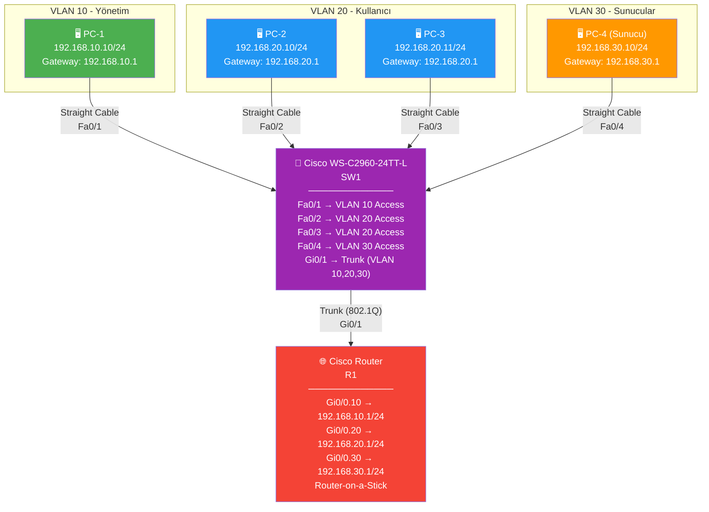
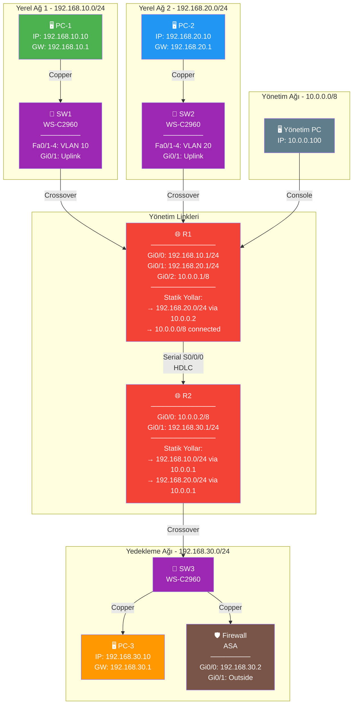
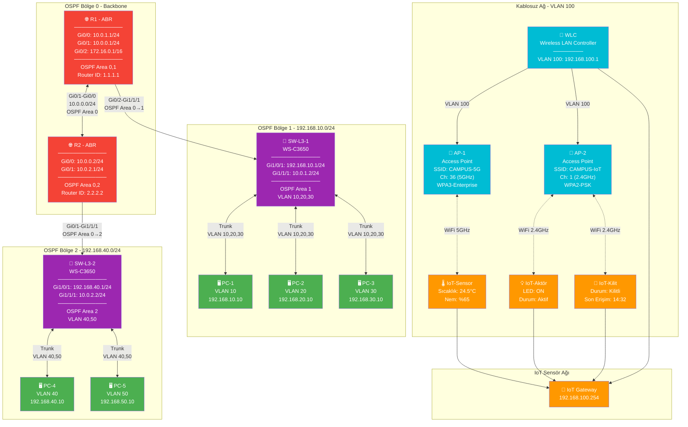
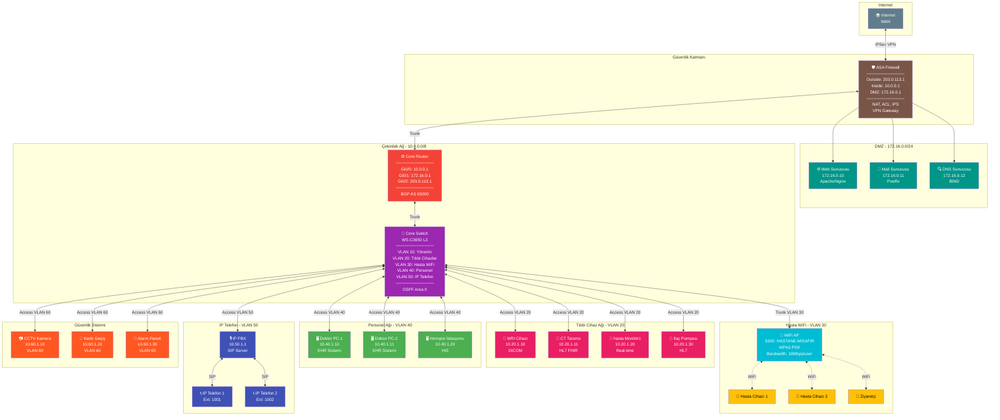
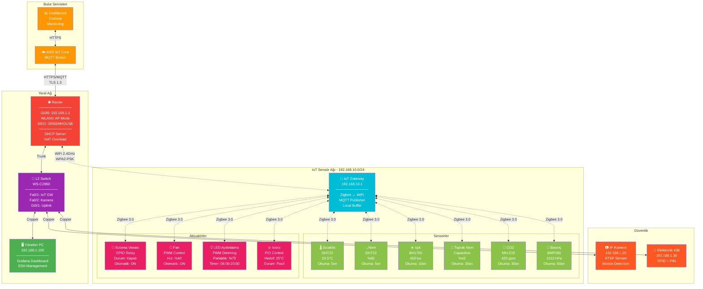

# Ağ Topolojisi Görsel Örnekleri - Network Simulator 2026

## 1. Temel Topoloji: Tek Switch ile VLAN Yapıllandırması

---

## 2. Orta Seviye: Statik Yaplama ve Campusa Ağ

---

## 3. İleri Seviye: OSPF Çoklu Bölge ve Kablosuz Ağ

---

## 4. Gerçek Dünya Senaryosu: Hastane Ağı

---

## 5. Kurumsal Kampüs Ağı - Tam Örnek

```mermaid
graph TB
    subgraph "WAN"
        INET["🌍 Internet<br/>ISP"]
        MPLS["🔗 MPLS WAN<br/>Şube Bağlantısı"]
    end

    subgraph "Veri Merkezi"
        DC_FW["🛡️ DC Firewall<br/>Palo Alto"]
        DC_SW["🔀 DC Core<br/>Nexus 9K"]
        SRV_WEB["🌐 Web Server<br/>10.10.1.10"]
        SRV_DB["🗄️ Database<br/>10.10.1.20"]
        SRV_APP["⚙️ App Server<br/>10.10.1.30"]
        SRV_BACKUP["💾 Backup<br/>10.10.1.40"]
    end

    subgraph "Ana Kampüs - Bina A"
        BLDG_A_SW["🔀 Bina-A Switch<br/>WS-C3650 L3"]
        WIFI_A["📶 WiFi AP x4<br/>SSID: CAMPUS-Corp<br/>802.1X RADIUS"]

        OFFICE1["🏢 Ofis 1<br/>PC, Yazıcı<br/>VLAN 100"]
        OFFICE2["🏢 Ofis 2<br/>PC, Telefon<br/>VLAN 100"]
        CONF["📋 Toplantı<br/>Video Konferans<br/>VLAN 200"]
        LAB["🔬 Lab<br/>Test Cihazları<br/>VLAN 300"]
    end

    subgraph "İkincil Kampüs - Bina B"
        BLDG_B_SW["🔀 Bina-B Switch<br/>WS-C3650 L3"]
        WIFI_B["📶 WiFi AP x2<br/>SSID: CAMPUS-Guest<br/>Captive Portal"]

        HALL["🎓 Konferans<br/>200+ Kişi<br/>VLAN 400"]
        LIBRARY["📚 Kütüphane<br/>PC Lab<br/>VLAN 500"]
    end

    subgraph "Stadyum / Etkinlik Alanı"
        EVENT_SW["🔀 Event Switch<br/>PoE+"]
        CAM1["📷 Kamera x8<br/>VLAN 600"]
        SCOREBOARD["📊 Skorboard<br/>VLAN 600"]
        VIP["🎪 VIP Alan<br/>WiFi + TV<br/>VLAN 700"]
    end

    subgraph "Altyapı"
        NTP["🕐 NTP Server<br/>10.10.2.1"]
        SYSLOG["📝 Syslog<br/>10.10.2.2"]
        RADIUS["🔑 RADIUS<br/>10.10.2.3"]
        SNMP["📊 SNMP Monitor<br/>10.10.2.4"]
    end

    INET <--> DC_FW
    MPLS <--> DC_FW
    DC_FW <--> DC_SW

    DC_SW --> SRV_WEB
    DC_SW --> SRV_DB
    DC_SW --> SRV_APP
    DC_SW --> SRV_BACKUP

    DC_SW <-->|"10G Uplink<br/>LACP EtherChannel"| BLDG_A_SW
    DC_SW <-->|"10G Uplink<br/>LACP EtherChannel"| BLDG_B_SW
    DC_SW <-->|"Fiber Uplink"| EVENT_SW

    BLDG_A_SW <--> OFFICE1
    BLDG_A_SW <--> OFFICE2
    BLDG_A_SW <--> CONF
    BLDG_A_SW <--> LAB
    BLDG_A_SW <--> WIFI_A

    BLDG_B_SW <--> HALL
    BLDG_B_SW <--> LIBRARY
    BLDG_B_SW <--> WIFI_B

    EVENT_SW --> CAM1
    EVENT_SW --> SCOREBOARD
    EVENT_SW --> VIP

    DC_SW --> NTP
    DC_SW --> SYSLOG
    DC_SW --> RADIUS
    DC_SW --> SNMP

    style INET fill:#607D8B,color:#fff
    style MPLS fill:#607D8B,color:#fff
    style DC_FW fill:#795548,color:#fff
    style DC_SW fill:#9C27B0,color:#fff
    style SRV_WEB fill:#009688,color:#fff
    style SRV_DB fill:#009688,color:#fff
    style SRV_APP fill:#009688,color:#fff
    style SRV_BACKUP fill:#009688,color:#fff
    style BLDG_A_SW fill:#9C27B0,color:#fff
    style BLDG_B_SW fill:#9C27B0,color:#fff
    style EVENT_SW fill:#9C27B0,color:#fff
    style WIFI_A fill:#00BCD4,color:#fff
    style WIFI_B fill:#00BCD4,color:#fff
    style OFFICE1 fill:#4CAF50,color:#fff
    style OFFICE2 fill:#4CAF50,color:#fff
    style CONF fill:#4CAF50,color:#fff
    style LAB fill:#4CAF50,color:#fff
    style HALL fill:#4CAF50,color:#fff
    style LIBRARY fill:#4CAF50,color:#fff
    style CAM1 fill:#FF5722,color:#fff
    style SCOREBOARD fill:#FF5722,color:#fff
    style VIP fill:#FFC107,color:#000
    style NTP fill:#FF9800,color:#fff
    style SYSLOG fill:#FF9800,color:#fff
    style RADIUS fill:#FF9800,color:#fff
    style SNMP fill:#FF9800,color:#fff
```

---

## 6. Akıllı Yeşil Serada IoT Topolojisi

---

## Kısaltmalar

| Kısaltma | Açıklama |
|----------|----------|
| SW | Switch (Anahtarlama Cihazı) |
| R | Router (Yönlendirici) |
| FW | Firewall (Güvenlik Duvarı) |
| AP | Access Point (Erişim Noktası) |
| WLC | Wireless LAN Controller |
| PC | Personal Computer |
| IoT | Internet of Things (Nesnelerin İnterneti) |
| VLAN | Virtual Local Area Network |
| OSPF | Open Shortest Path First |
| STP | Spanning Tree Protocol |
| ACL | Access Control List |
| NAT | Network Address Translation |
| LACP | Link Aggregation Control Protocol |
| PoE | Power over Ethernet |

---

*Bu dosya Network Simulator 2026 uygulaması tarafından desteklenen tüm cihaz türlerini ve ağ yapılandırma senaryolarını görsel olarak göstermektedir.*
